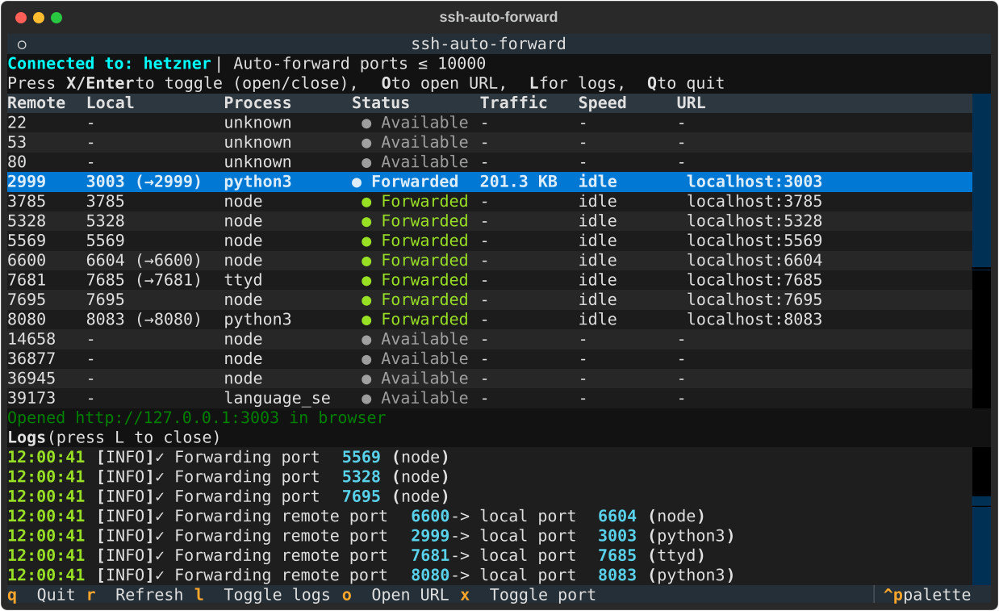

# SSH Auto Port Forwarder

Automatically detect and forward ports from a remote SSH server to your local machine. Similar to VS Code's port forwarding feature, but fully automatic.



## Features

- Interactive TUI dashboard - View and manage tunnels in real-time
- Host selector modal - Choose from your SSH config hosts when no host specified
- Automatically discovers listening ports on the remote server
- Save friendly names for ports per SSH host
- Shows compact process names and working folders for discovered ports
- Forwards ports to your local machine via SSH tunneling
- Handles port conflicts by finding alternative local ports
- Remap ports to specific local ports via dashboard
- Auto-detects new ports and starts forwarding
- Auto-detects closed ports and stops forwarding
- Reads connection details from your SSH config
- Shows SSH LocalForward ports with "Auto (SSH Config)" status
- Skips well-known ports (< 1000) by default
- Configurable max auto-forward port (default: 10000)
- Auto-reconnect on connection loss with countdown
- Runs SSH scans in the background so dashboard navigation stays responsive

## Installation

### With uv (recommended):

```bash
uvx ssh-auto-forward hetzner
```

### Install with pip:

```bash
pip install ssh-auto-forward
```

### Install locally:

```bash
cd portforwards
uv sync
```

## Running

### Dashboard mode (default):

```bash
ssh-auto-forward hetzner
```

### CLI mode (headless):

```bash
ssh-auto-forward hetzner --cli
```

### With uvx (no installation):

```bash
uvx ssh-auto-forward hetzner
```

## Dashboard Controls

| Key | Action |
|-----|--------|
| X / Enter | Toggle port (open if closed, close if opened) |
| O | Open URL in browser (for forwarded ports) |
| N | Name the selected port |
| M | Remap port to specific local port |
| R | Refresh port list |
| L | Toggle log panel |
| Q | Quit |

**Arrow keys** navigate the port list. **Space** works the same as Enter for selections.

## Options

```
-v, --verbose              Enable verbose logging
-i, --interval SECS        Scan interval in seconds (default: 5)
-p, --port-range MIN:MAX   Local port range for remapping (default: 3000:10000)
-s, --skip PORTS           Comma-separated ports to skip (default: all ports < 1000)
-c, --config PATH          Path to SSH config file
-m, --max-auto-port PORT   Maximum port to auto-forward (default: 10000)
--cli                      Run in CLI mode instead of dashboard
--version                  Show version and exit
```

## Examples

```bash
# Dashboard mode (default)
ssh-auto-forward hetzner

# CLI mode
ssh-auto-forward hetzner --cli

# Scan every 3 seconds
ssh-auto-forward hetzner -i 3

# Use specific port range
ssh-auto-forward hetzner -p 4000:9000

# Skip specific ports
ssh-auto-forward hetzner -s 22,80,443

# Verbose mode
ssh-auto-forward hetzner -v

# Only auto-forward ports up to 5000 (higher ports shown but not auto-forwarded)
ssh-auto-forward hetzner -m 5000
```

## Performance

Throughput is 150-190 MB/s for large file transfers (45-70% of native `ssh -L`). HTML page latency is 2-3 ms median at up to 10 req/s with zero failures. The overhead comes from paramiko (Python) vs OpenSSH (C) - negligible for interactive use like web browsing.

See [benchmarks/](benchmarks/) for full methodology and results.

## How it works

1. Connects to your remote server using your SSH config
2. Runs `ss -tlnp` on the remote to find listening ports
3. Creates SSH tunnels for each discovered port
4. Continuously monitors for new/closed ports
5. Handles port conflicts on your local machine

### SSH Config Integration

The tool reads your SSH config file (`~/.ssh/config`) for connection details. It also respects `LocalForward` directives:

```ssh
Host myserver
    HostName example.com
    User myuser
    LocalForward 5432 db.amazonaws.com:5432
    LocalForward 3000 localhost:3000
```

Ports forwarded via `LocalForward` appear in the dashboard with **"Auto (SSH Config)"** status. These are read-only since they're managed by SSH itself, not by ssh-auto-forward.

By default, hosts with `LocalForward` directives are hidden in the host selector. Toggle "Show hosts with local forwards" to display them.

## Status messages

```
✓ Connected!
✓ Forwarding port 2999 (python3)
✓ Forwarding port 7681 (ttyd)
✓ Forwarding remote port 19840 -> local port 3000 (node)
✗ Remote port 2999 is no longer listening, stopping tunnel
```

## Testing

Start a test server on your remote machine:

```bash
ssh hetzner "python3 -m http.server 9999 --bind 127.0.0.1 &"
```

Then run `ssh-auto-forward hetzner` and access it locally:

```bash
curl http://localhost:9999/
```

## Stopping

- Dashboard: Press `Q`
- CLI mode: Press `Ctrl+C`

## Requirements

- Python 3.10+
- paramiko
- textual (for TUI dashboard)
- Remote server must have `ss` or `netstat` command available

## Tests

### Unit tests (run locally, no SSH required):

```bash
uv run pytest tests/ -v
```

### Integration tests (Docker, default):

```bash
uv run pytest tests_integration/ -v
```

This starts a Docker container with SSH server and tests against it.

### Integration tests (real SSH server):

```bash
SSH_AUTO_FORWARD_TEST_HOST=your-server uv run pytest tests_integration/ -v
```

## Development

### Code Formatting and Linting

We use [ruff](https://docs.astral.sh/ruff/) for fast Python linting and formatting.

```bash
# Install ruff (if not using uv sync)
uv pip install ruff

# Check code
uv run ruff check ssh_auto_forward/

# Auto-fix issues
uv run ruff check --fix ssh_auto_forward/

# Format code
uv run ruff format ssh_auto_forward/
```

### Pre-commit Hooks

Install pre-commit hooks to automatically run ruff before each commit:

```bash
# Install pre-commit
uv pip install pre-commit

# Install the git hooks
pre-commit install
```

Now ruff will run automatically on `git commit`.
